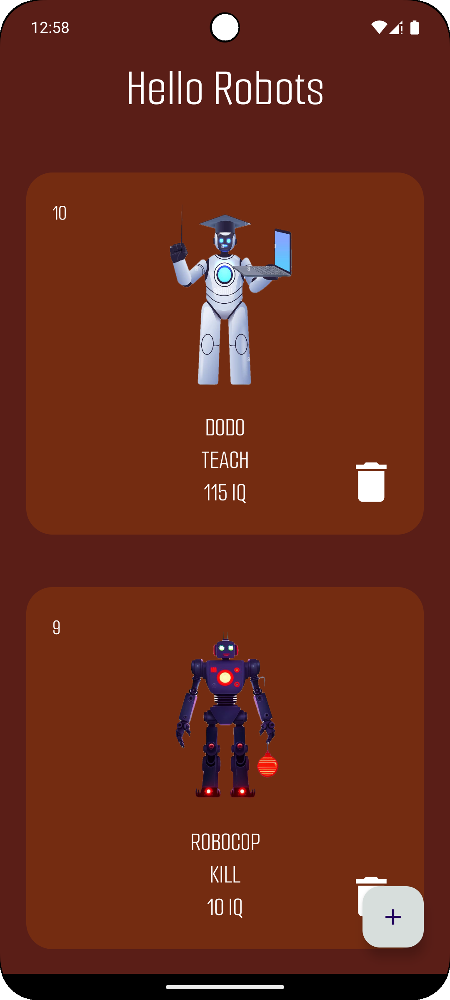
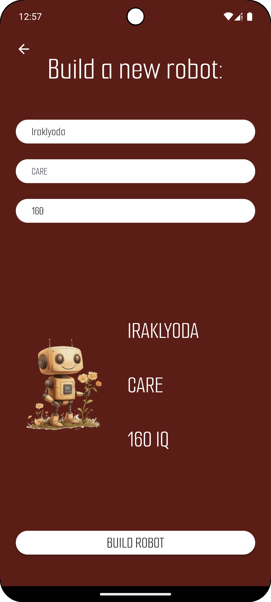

# Robot Management - Android Room CRUD Application

  

## Overview

This Android project is a simple **robot management application** that allows users to create, update, and delete robots with specific attributes. The app uses **Room** for local database management, **ViewModels** for UI-related data, and **Fragments** for navigation between different screens.

## Features

- **Create new robots** set custom name, purpose, and IQ.
- **Update existing robots** and change their attributes.
- **Delete robots** from the list as needed.
- **Offline support** – Data persists even when offline.
- **Utilizes ViewModel** to manage UI-related data in a lifecycle-conscious way.
- **Navigation components** for seamless transitions between fragments.

## How It Works

1. **Add robots** with attributes such as name, purpose (Killer, Teacher, Dancer or Caring one), and IQ.
2. **Display robot list** in a RecyclerView using list adapter.
3. **Update or delete robots** through the UI.
4. **Use Room for local data storage** and persist robot information even when the app is closed.
5. **Manage UI state** with ViewModels and Flow.

## Screenshots

    
    

## Technologies Used

- **Kotlin**
- **Room Database**
- **ViewModel**
- **Navigation Component**
- **Coroutines**
- **RecyclerView**
